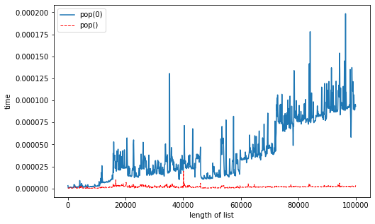
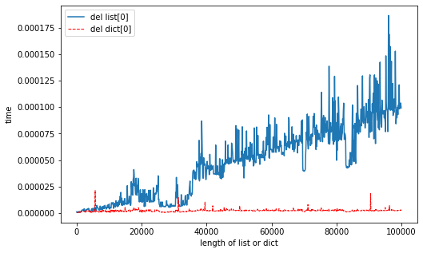

# 数据结构与算法	HW2

<font size='5'>唐苛耕 19309129 通信工程</font>

## I.分别写出实现下列方案的python代码

- 1.创建一个列表l1，初始元素为11,22,33；


```python
l1 = [11,22,33]
```

- 2.添加两个元素44和55；


```python
l1.extend([44,55])
```

- 3.打印l1；


```python
print(l1)
```

    [11, 22, 33, 44, 55]


- 4.删除22，并将11改为12；


```python
l1[0] = 12
```

- 5.截取第二个元素起到第四个成立一个新列表l2并输出；


```python
l2 = l1[1:4]
print(l2)
```

    [22, 33]


- 6.在l1中搜索元素33所在位置；


```python
l1.index(33)
```


    2

- 7.将l2反向并输出；


```python
print(l2[::-1])
```

    [44, 33, 22]


- 8.输出l1的最大值，l2的最小值；


```python
print(max(l1))
print(min(l2))
```

    33
    22


- 9.将22插入到l1中的第四个位置；


```python
l1.insert(3,22)
```

- 10.对l1进行排序；


```python
l1.sort()
```

- 11.对l1每个元素的值+1。


```python
l1 = [i + 1 for i in l1]
```

## II.	做计时实验，比较list的pop()和pop(0)的性能 

- 代码：计算`pop()`和`pop(0)`的时长数据，根据数据，利用`matplotlib`库直接绘出曲线，以作对比。


```python
import time as t
import matplotlib.pyplot as plt
import numpy as np

#计算pop(0)运行时长
def timer1(length):
    a = [i for i in range(length)]
    start = t.perf_counter()
    a.pop(0)
    end = t.perf_counter()
    return (end - start)

#计算pop()运行时长
def timer2(length):
    a = [i for i in range(length)]
    start = t.perf_counter()
    a.pop()
    end = t.perf_counter()
    return (end - start)

def main():
    result1,result2 = [],[]
    length = np.arange(1,100000,100)
    
    #计算相关时间，并分别添加到列表result1,result2中
    for i in length:
        result1.append(timer1(i))
        result2.append(timer2(i))
        
    #作出两者的时间-长度曲线    
    plt.figure(figsize = (8,5))
    plt.plot(length,result1,label='pop(0)')
	plt.plot(length,result2,color='red',linewidth=1.0,linestyle='--',label='pop()')
    plt.xlabel('length of list')
    plt.ylabel('time')
    plt.legend()
main()
```
- 运行结果


- 数据说明

  列表长度最小为1，以100为步长，直到100000。每一个列表都进行`pop()`和`pop(0)`操作，并且利用`time`库的`perf_counter()`方法计算出对应的时长，并且导入`result1`和`result2`两个列表中，最后利用`matplotlib`绘出曲线。

- 实验结果分析

  如图所示，`pop(0)`大致呈一次函数增长，而`pop()`为常值函数。因此，`pop(0)`的时间复杂度是$O（n）$,`pop()`的时间复杂度是$O（1）$。

## III.做计时实验，比较list和dict的del操作符性能，即 del lst[i]和del dic[key]

- 代码：计算`del lst[i]`和`del dic[key]`的时长数据，根据数据，利用`matplotlib`库直接绘出曲线，以作对比。


```python
import time as t
import matplotlib.pyplot as plt
import numpy as np

#计算del a[0]运行时长
def timer1(length):
    a = [i for i in range(length)]
    start = t.perf_counter()
    del a[0]
    end = t.perf_counter()
    return (end - start)

#计算del dic[0]运行时长
def timer2(length):
    a = [i for i in range(length)]
    dic = {}
    for i in range(length):
        dic[i] = i
    start = t.perf_counter()
    del dic[0]
    end = t.perf_counter()
    return (end - start)

def main():
    result1,result2 = [],[]
    length = np.arange(1,100000,100)
    
    #计算相关时间，并分别添加到列表result1,result2中
    for i in length:
        result1.append(timer1(i))
        result2.append(timer2(i))
    
    #作出两者的时间-长度曲线
    plt.figure(num = 3, figsize = (8,5))
    plt.plot(length,result1,label = 'del list[0]')
    plt.plot(length,result2,color='red',linewidth=1.0,linestyle='--',label = 'del dict[0]')
    plt.xlabel('length of list or dict')
    plt.ylabel('time')
    plt.legend()
main()
```

- 运行结果


- 数据说明

  列表长度最小为1，以100为步长，直到100000。每一个列表都进行`del lst[i]`和`del dic[key]`操作，并且利用`time`库的`perf_counter()`方法计算出对应的时长，并且导入`result1`和`result2`两个列表中，最后利用`matplotlib`绘出曲线。
  
- 实验结果分析

  如图所示，`del lst[i]`大致呈一次函数增长，而`del dic[key]`为常值函数。因此，`del lst[i]`的时间复杂度是$O（n）$,`del dic[key]`的时间复杂度是$O（1）$。
